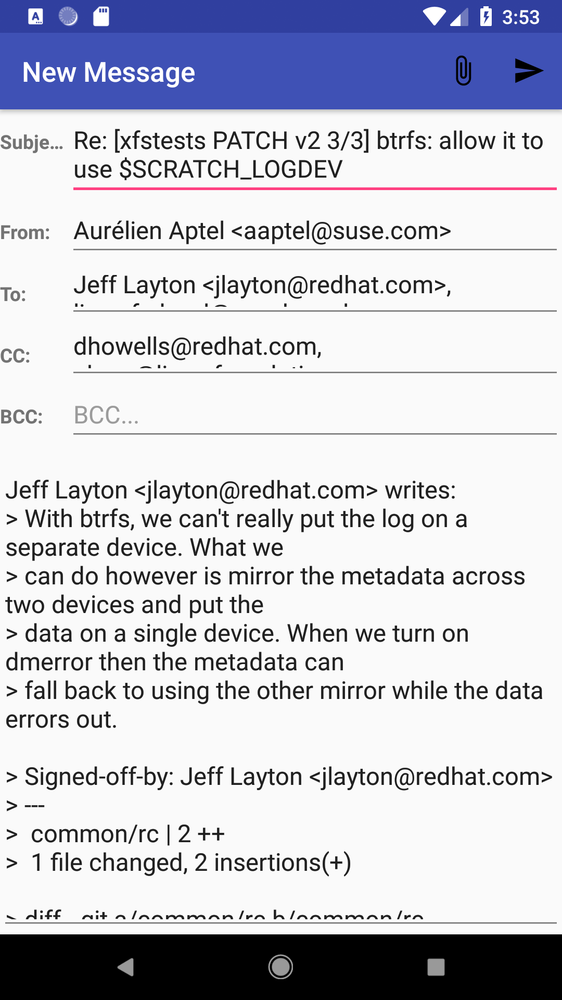

notmuch-android
===============

Notmuch-android is an email client for android. It's a bit unsusual in
that it doesn't use the usual email protocols (IMAP, POP, ...) to
fetch emails. Instead the app is a [notmuch](http://notmuchmail.org)
frontend and simply runs the notmuch program over ssh.

In order to use notmuch-android you need a server you can connect to
and run "notmuch" on.

Status
======

This project is still a WIP:

* DONE: Searching/listing emails using notmuch queries
* DONE: Looking at threads (viewing one search results)
* DONE: Composing/Replying to emails (**sending not implemented yet**)
* TODO: ssh key pair generation and pubkey auth
* TODO: making RFC2822 emails out of the Compose content and actually send them
* TODO: list more than 10 search result (implement search pagination)
* TODO: do background polling and notify when new emails arrive
* TODO: use ssh builtin compression
* TODO: tagging and marking things as read (**right now notmuch-android is pretty much read-only**)
* TODO: make UI better

You can look for TODO in the source code for more.

Right now, the focus is getting the main things working (reading,
writing, sending). Once this base is done, the focus will be on making
it more useable from a UX point of view.

Screenshots
===========

Building
========

* Get the Android Studio IDE for your OS from
  [here](https://developer.android.com/studio/). The whole IDE is
  self-contained in that zip file, it's pretty straighforward to
  install.
* (There might be a way to build from the command-line, but you will
  have to search that on your own)
* Open this project, then in the menu bar: Build > Build APK.
